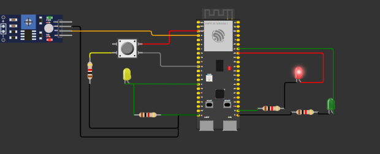
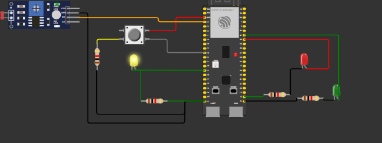

# 2° Parte da prova do módulo 04
**Aluo: Mateus Beppler Pereira**
**Turma: 13**
**Data: 13/12/2024**

## Estados do Sistema

### 1. Estado Normal (Ambiente Claro)
O semáforo opera em um ciclo normal com três estados:

- **Vermelho**: 
  - Duração: 5 segundos
  - LED vermelho aceso
  - Pode ser interrompido por botão

- **Verde**: 
  - Duração: 3 segundos
  - LED verde aceso

- **Amarelo**: 
  - Duração: 2 segundos
  - LED amarelo aceso

### 2. Modo Noturno
Quando o sensor LDR detecta baixa luminosidade (valor >= 600):
- LED amarelo pisca em intervalos de 1 segundo
- Demais LEDs permanecem apagados

### 3. Estado de Interação com Botão
Durante o sinal vermelho:
- Um pressionamento: Muda para verde após 1 segundo
- Três pressionamentos: Envia requisição HTTP

## Recursos de Segurança
- **Debounce**: Implementado com delay de 50ms para evitar leituras falsas do botão
- **Contador de Pressionamentos**: Reset após 3 pressionamentos ou mudança de estado